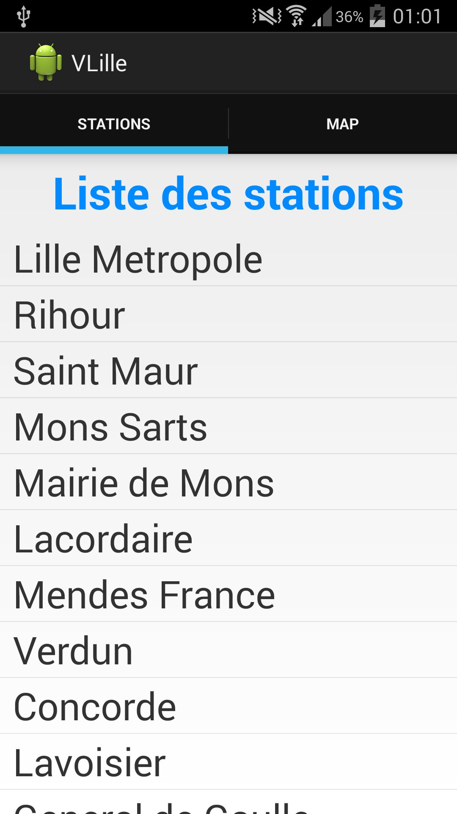

<!-- https://github.com/adam-p/markdown-here/wiki/Markdown-Here-Cheatsheet#code -->

APPLICATION ANDROID VLILLE
==========================

* PHILIPPON Romain

07 / 10 / 2014

PRÉSENTATION
------------
Cette application Android a été développée dans le cadre du module IFI. Elle permet 
de consulter en temps réel l'état des stations de vélos [VLille](http://vlille.fr). Elle offre deux façons de 
voir ces informations : Soit sous forme d'une liste contenant l'ensemble des stations disponibles,
soit d'utiliser une GoogleMap marquant chaque station de vélos.

Cette application en plus d'utiliser la technologie [`Android`](http://developer.android.com), utilise 
également [`l'API Google Maps Android v2`](https://developers.google.com/maps/documentation/android/)

DÉTAILS TECHNIQUES
------------------

###Paquetages####

Le projet est composé d'un package global `iagl.project.jimipepper.vlille` qui
contient l'ensemble des classes pour faire fonctionner cette application.

Cependant ces classes ont été rangées dans des packages différentes, suivant la logique ci-dessous :
  1. `iagl.project.jimipepper.vlille.activity` sert à ranger toutes les activités de l'application.
  2. `iagl.project.jimipepper.vlille.fragment` contient tous les fragments développés pour ce projet.
  3. `iagl.project.jimipepper.vlille.ihm` englobe l'ensemble des classes qui redéfinisse un élément d'une vue utilisateur.
  4. `iagl.project.jimipepper.vlille.task` comprend toutes les classes dérivant de `android.os.AsyncTask`.
  5. `iagl.project.jimipepper.vlille.util` intègre toutes les classes permettant de récupérer les données sur les web-services de Transpôle.

###Fonctionnalités###

L'application est capable de :
* lister toutes les stations VLille
* lors de l'appui du doigt sur un item de cette liste, d'afficher en fonction du statut de la station le détail des informations la concernant
* d'afficher une GoogleMap marquée par toutes les stations VLille existantes
* d'afficher le nombre de vélos et d'emplacement restants lors de l'appui du doigt sur un marqueur de la GoogleMap

SCREENSHOTS
-----------

###Sur Smartphone###

###Sur Tablette###

